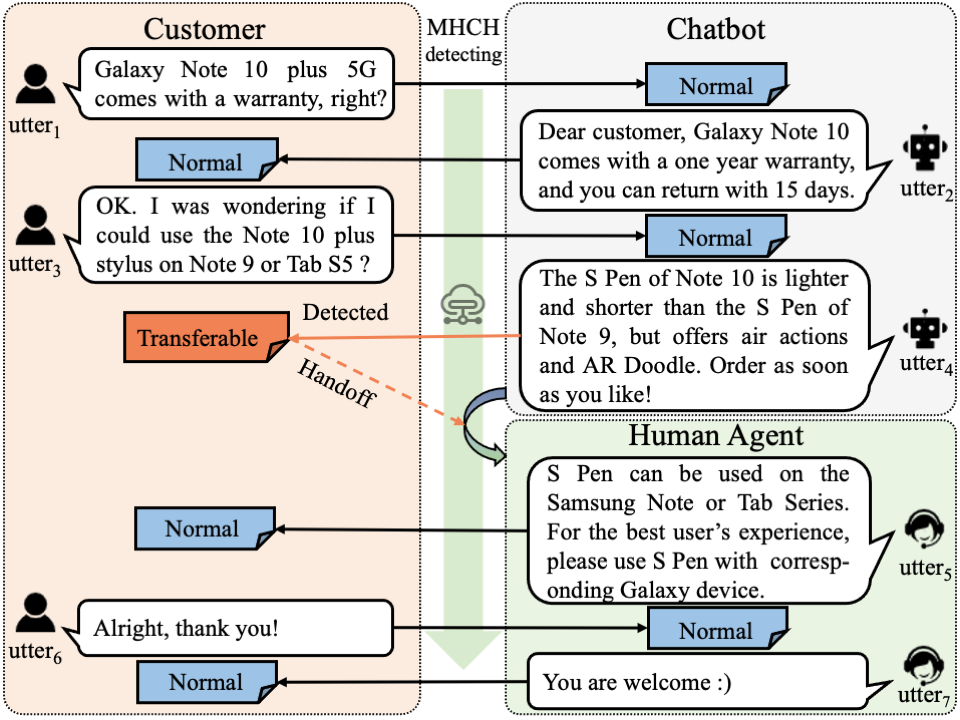

# Machine-Human Chatting Handoff
Tensorflow implementation of the AAAI-2021 paper: [Time to Transfer: Predicting and Evaluating Machine-Human Chatting Handoff](https://arxiv.org/pdf/2012.07610.pdf)

<div align=center></div>

## Requirements

* Python 3.6 or higher
* tensorflow=1.14
* Keras==2.2.5
* tqdm==4.35.0
* jieba==0.39
* gensim==3.8.3
* snownlp==0.12.3

## Environment

* Tesla V100 16GB GPU
* CUDA 10.2

## Data Example
```json
C2B: *产品链接* 	(*URL of a product*)	[Normal]
C2B: 买二送一。	(Buy two free one.)	[Normal]
B2C: 亲亲您可以直接拍下您喜欢的(同一链接内)的3双加入购物车,付款的时候系统会在的减价的哦~ 	(Dear,  you can add your favorite three goods to shopping cart directly. The system will cut the price automatically when you pay! )	[Normal]
C2B: 买的时候怎么一下买三条？	(How to buy three goods at once? )	[Normal]
B2C: 亲亲，活动页面会有具体介绍若有满三减一活动的，直接拍下三双系统会自动立减的建议按现有的颜色组合拍。	(Dear, there will be a specific introduction on the detail page. If we have buy-two-free-one promotions, the system will cut the price automatically when you buy three goods. )	[Normal]
C2B: 怎么能才能买一送一？	(How to enjoy buy one get one free? )	[Normal]
B2C: 亲可以关注下我们店铺首页有活动的话会有详细说明哦单链接宝贝也经常会有买赠活动呢^-^近期活动如：活动1【袜宝贝】现时的优惠活动是满减哦 *URL of a product* 买二送一领券满28元立减10元，满58减20元，满88减30元……拍下自动减价，买得多减得多哦送的须自行备注好，若没有备注仓库会随机送哦! 活动2【身材管理——束腰、塑体衣、塑体裤、胸托等】新品促销、爆款上新，惊喜连连哦^-^ *URL of a product* ; 更多宝贝或活动请按分类查找哦。	(Dear, you can pay attention to the activities on the homepage of our store. If there are activities, there will be detailed explanations. Single link products will often have buy-and-free activities^-^ Recent activities such as Activity 1 [Socks] The current discount activities are buy-and-free. *Product URL*. Buy two, get one free coupon for over 28 Yuan and get 10 Yuan off, over 58 off 20 Yuan, over 88 off 30 Yuan. The system will automatically reduce the price, buy more, and get more discounts. You must notify us by yourself. If there is no notification, the warehouse will send it randomly! Activity 2 "body management-waist, body shaping clothes, body shaping pants, chest support, etc."  We are promoting new products; there are lots of new styles and surprises ^-^ *Product URL*; Please find more items or activities by category.)	[Transferable]
B2C: 亲您拍下的宝贝还处于未付款状态哦，您请及时付款。我们发货是按照付款先后排单的，优先付款优先发货哦!	( Dear, your order has not been paid yet. We will give priority to delivery goods if you pay early.)	[Normal]
C2B: 我不知道怎么去拍啊！	( I don't understand how to place orders.)	[Transferable]
B2C: 小姐姐一般详情页会有说明，若问题还没解决请直接敲“人工”		(Beauties, the detail page will have instructions. If the problem has not been resolved, please type "manual".)	[Normal]
C2B: *产品链接* 	(*URL of a product*)	[Normal]
C2B: 有没有活人？	(Are there any living people? )	[Transferable]
```

## Usage

1. Data processing

    To construct the vocabulary from the pre-trained word embeddings and corpus.  For the security of private information from customers, we performed the data desensitization and converted words to IDs. We save the processed data into pickle file.

    ```
    python data_prepare.py
    ```
    The pickle object contains: dialogue contents (word ID), role information, term frequency, POS tag, sentiment, length of utterance, length of dialogue, handoff labels

2. Train the model

    python main.py --phase train --model_name dami --data_name clothing --memory 0 --suffix .128 --mode train  --ways dami


## Data

We propose two Chinese sales customer service dialogue datasets, namely Clothing and Makeup, which are collected from [Taobao](https://www.taobao.com/), one of the largest decentralized E-commerce platforms in the world. Clothing is a corpus with 3,500 dialogues in the clothing domain and Makeup is a corpus with 4,000 dialogues in the makeup domain. For the security of private information from customers, we performed the data desensitization and converted words to IDs. As a result, you cannot directly analyze the language pattern of handoff, but the dataset still provides some statistical information.